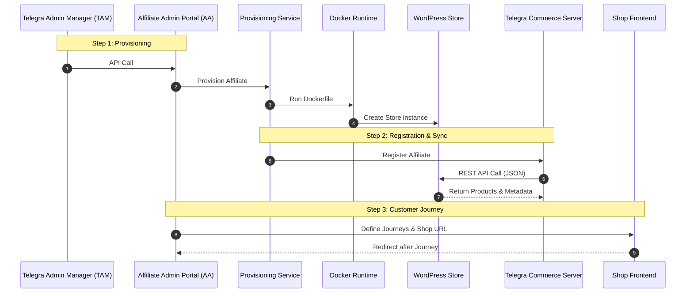
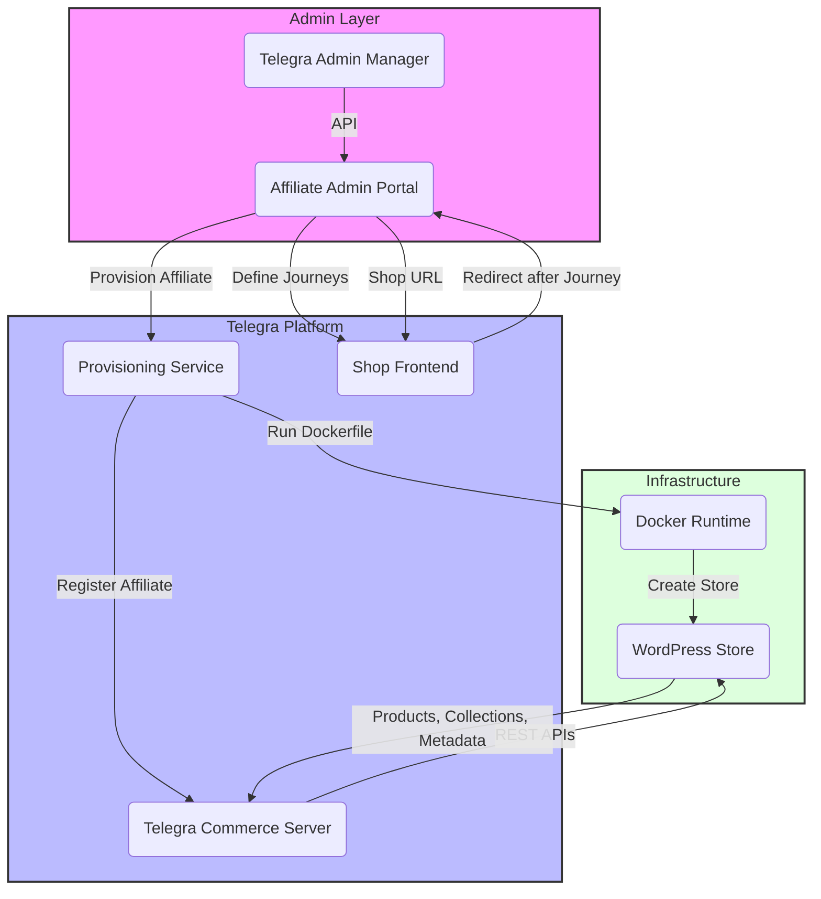

# Telegra Commerce Architecture

## Overview

The Telegra Commerce platform is a multi-layered, cloud-based e-commerce solution designed to support affiliates and healthcare providers. The architecture consists of three primary layers: Management, Infrastructure, and Commerce, with seamless integration between provisioning, store management, and customer-facing applications.

## Architecture Diagram

```mermaid
architecture-beta
    group mgt(cloud)[Management]
    group infra(cloud)[Infrastructure]
    group shop(cloud)[Commerce]
        
    service tam(server)[TAM] in mgt
    service portal(internet)[Affiliate Admin Portal] in mgt
            
    service docker(mdi:docker)[Docker] in infra
    service prov(mdi:cog)[Provisioning] in infra
            
    service wp(disk)[WP Store] in shop
    service tcs(server)[TCS] in shop
    service sf(internet)[Shop Frontend] in shop
        
    %% Infrastructure Path (straight lines)
    tam:R -- L:portal
    portal:R -- L:prov
    prov:R -- L:docker
    docker:R -- L:wp
        
    %% Data & Journey Logic (avoid Docker overlap)
    wp:R -- L:tcs
    portal:L -- L:tcs
        
    %% Final Journey Connection
    portal:R -- L:sf
```

## System Flow - Sequence Diagram

This diagram illustrates the complete flow from admin provisioning through customer journey implementation:

## Component Interactions - Flowchart

Detailed view of the relationships between all system components:

## Core Components

### Management Layer

- **Telegra Admin Manager (TAM)**: Central administration interface for managing the entire platform
- **Affiliate Admin Portal (AA)**: Portal for affiliate partners to manage their stores, products, and customer journeys

### Infrastructure Layer

- **Provisioning Service**: Orchestrates the creation and configuration of new affiliate stores
- **Docker Runtime**: Container orchestration platform for isolated store instances

### Commerce Layer

- **WordPress Store (WP)**: E-commerce backend managing products, collections, inventory, and metadata
- **Telegra Commerce Server (TCS)**: Core REST API backend handling business logic, orders, payments, and integrations
- **Shop Frontend (SF)**: Customer-facing React application for browsing and purchasing products

## Key Integration Points

### 1. Provisioning Workflow

- Admin initiates affiliate provisioning through the TAM
- Portal submits provisioning request to the Provisioning Service
- Provisioning Service spawns isolated Docker containers running WordPress instances
- Each store instance is registered with the TCS

### 2. Data Synchronization

- TCS maintains synchronization with WP stores via REST APIs
- Product catalogs, collections, and metadata are bidirectionally synced
- Order and transaction data flows from TCS to WP for inventory management

### 3. Customer Journey Management

- Affiliates define customer journeys and funnels through the Admin Portal
- Journey configurations are deployed to the Shop Frontend
- Customer actions trigger data collection and redirects back to the Portal

## Data Flow

1. **Store Creation**: TAM → Portal → Provisioning → Docker → WP Store
2. **Affiliate Registration**: Provisioning → TCS
3. **Product Sync**: WP Store ↔ TCS (bidirectional REST APIs)
4. **Journey Definition**: Portal → Shop Frontend
5. **Customer Interaction**: Customer → Shop Frontend → Portal

## Technology Stack

- **Backend**: Node.js, Express.js, MongoDB
- **Frontend**: React, Next.js
- **Infrastructure**: Docker, Docker Compose, Nginx
- **Databases**: MongoDB (primary data store)
- **APIs**: RESTful architecture with JSON payloads
- **Provisioning**: Automated container orchestration

## Deployment Architecture

The platform supports multi-tenant deployment where:

- Each affiliate gets an isolated WordPress store instance via Docker
- All stores connect to a centralized TCS for core business logic
- Admin Portal and Shop Frontend are shared multi-tenant applications
- Data isolation is maintained at both container and database levels

---

Previous: [Installing and Running](installing-and-running.md)

Next: [Command Line Interface](cli.md)
